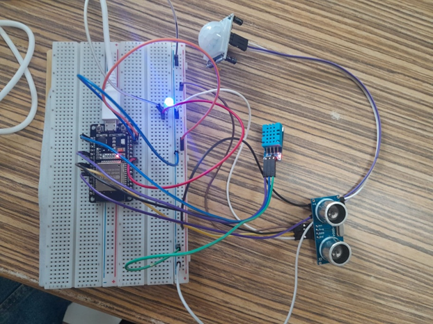
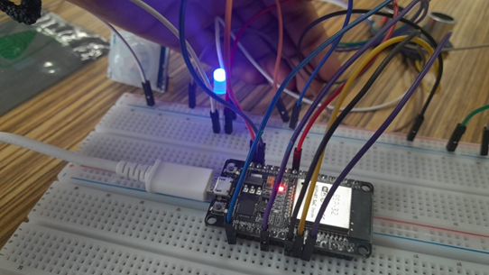
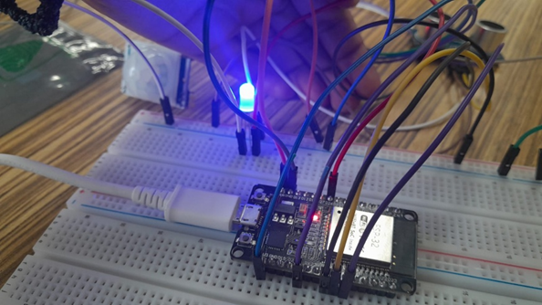

# Automatic Vehicle Headlight Dimmer System

---

## Title of the Project
**Automatic Vehicle Headlight Dimmer System using ESP32**

---

## Team Members

| Sl. No | Name                 | SRN             |
|--------|----------------------|-----------------|
| 1      | Ananya Raghavendra  | PES1UG24AM037   |
| 2      | Ananya S            | PES1UG24AM038   |
| 3      | Arpita Kotnur       | PES1UG24AM051   |

---

## Components Used

- ESP32 development board  
- PIR motion sensor  
- Ultrasonic sensor (HC-SR04)  
- Temperature & Humidity sensor (DHT11/DHT22)  
- RGB LED (used only blue color)  
- Breadboard x 2  
- Jumper wires  
- USB cable (power + programming)  

---

## Explanation about the Project

This project implements an **automatic vehicle headlight dimmer system** using multiple sensors.

The system detects the presence of an approaching vehicle using:

- Ultrasonic sensor → measures distance  
- PIR sensor → detects motion  
- Temperature & humidity sensor → adjusts sensitivity based on environmental conditions (fog/rain)  

When conditions indicate a nearby vehicle, the system automatically switches from **high beam to low beam**.

### Demonstration
- A **blue LED** is used to indicate beam status.

### Advantages
- Improves driving safety  
- Reduces glare  
- Helps prevent accidents  

---

## Circuit Diagram

*(Insert your drawn circuit diagram image here)*

---

## Pseudocode
START

LOOP:

Read distance from ultrasonic sensor
Read motion from PIR sensor
Read temperature and humidity

Set distance_threshold = 50 cm

IF humidity > 70%
Increase distance_threshold (e.g., 70–80 cm)
END IF

IF (motion detected AND distance < distance_threshold)
Set LED brightness = LOW (dim)
ELSE
Set LED brightness = HIGH (bright)
END IF

REPEAT LOOP

---

## Output Pictures with Explanation

---

### Circuit Diagram – Explanation

The circuit consists of an **ESP32 microcontroller** connected to three sensors and an LED used to simulate the headlight.

- ESP32 acts as the main controller  
- PIR sensor detects motion  
- Ultrasonic sensor measures distance  
- DHT sensor measures temperature and humidity  
- Blue LED represents the headlight  

#### Working:
- Sensors are powered using ESP32 rails (3.3V/5V and GND)  
- Sensors send signals to ESP32 GPIO pins  
- Based on sensor readings:  

  - LED remains ON at all times  
  - Brightness changes:
    - High beam → brighter  
    - Low beam → dimmer  

The system continuously monitors surroundings and adjusts brightness.

---

### Low Beam – Explanation (Dim Light Condition)

This condition occurs when another vehicle is detected nearby.

#### Conditions:
- Motion detected (PIR sensor)  
- Object is close (distance below threshold)  
- High humidity may increase sensitivity  

#### Working:
- ESP32 processes sensor data  
- LED brightness is reduced  

#### Result:
- Prevents glare to other drivers  
- Improves safety  

In our setup: LED is **ON but dim**

---

### High Beam – Explanation (Bright Light Condition)

This condition occurs when no vehicle is nearby.

#### Conditions:
- No motion detected  
- Object is far away  

#### Working:
- ESP32 keeps LED at full brightness  

#### Result:
- Maximum visibility  
- LED glows brightest  

In our setup: LED is **fully bright**

---

## Note

The LED is always ON in this system.  
Only the **brightness is varied** to simulate high and low beam.
And use 220 ohm resister(in series) for LED, to limit current and protect component.
---

## Conclusion

The project successfully demonstrates an **intelligent headlight control system** using sensors and ESP32, improving road safety by automatically adjusting light intensity.

---